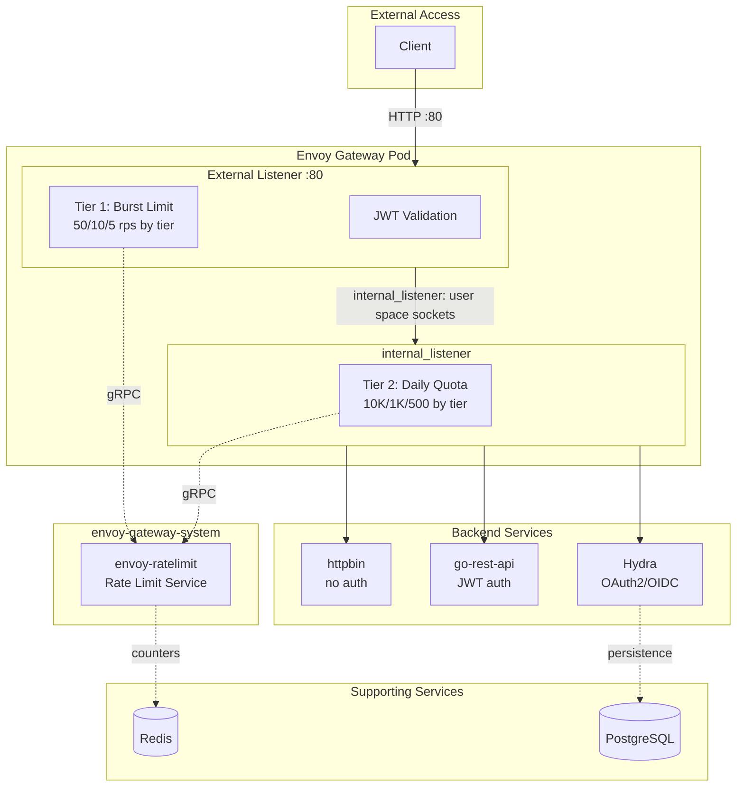
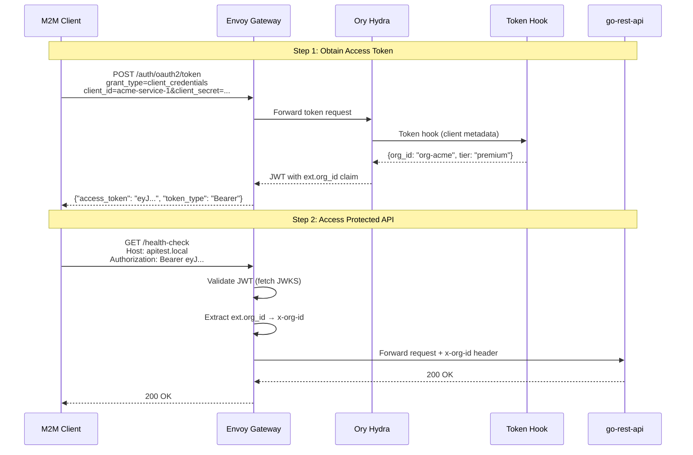
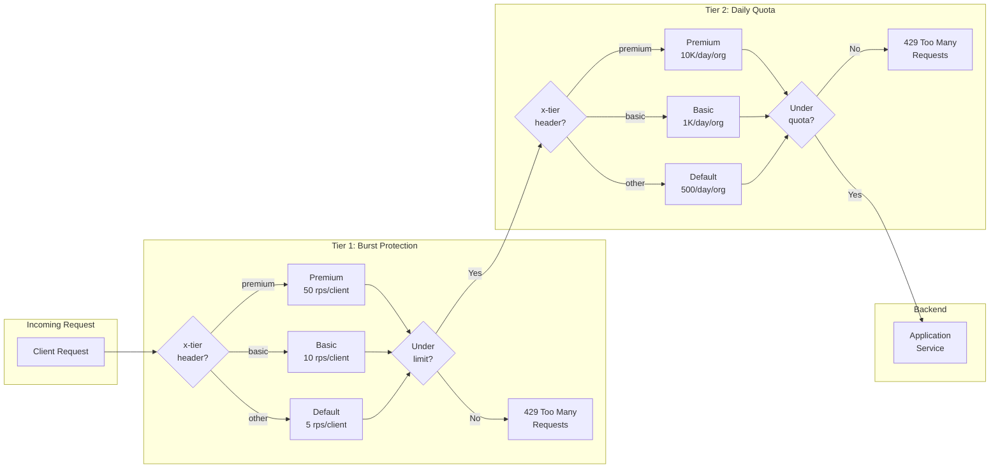
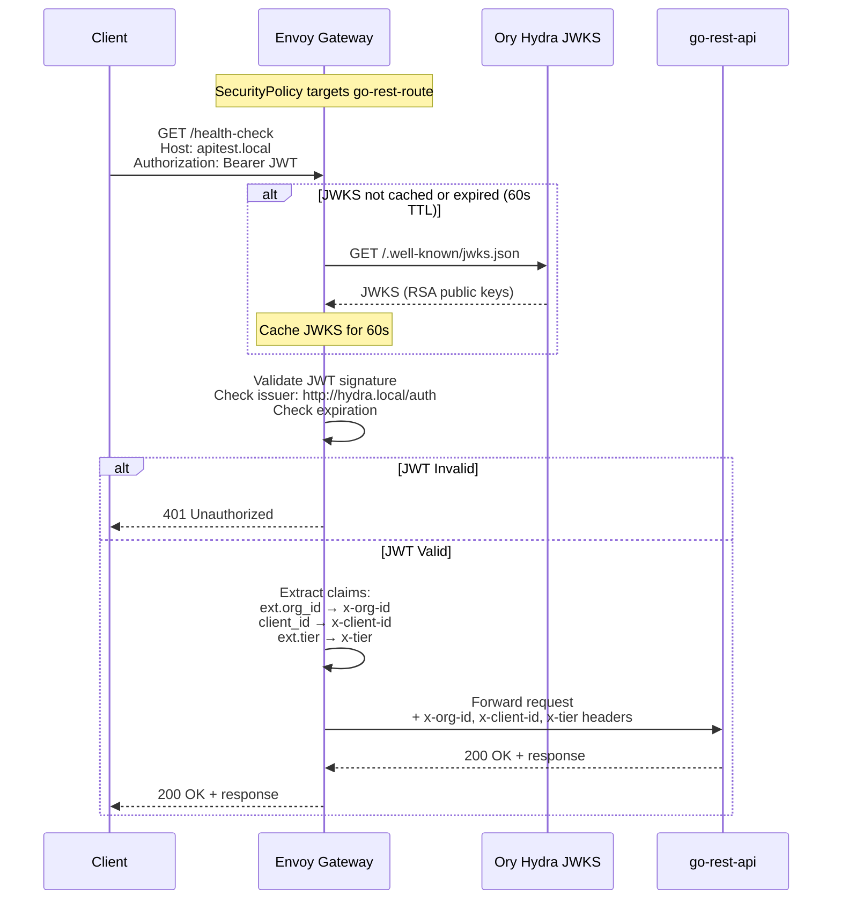

# Demo Gateway Requirements

## 1. Scope and Objectives

#### 1.1 The system MUST provide a reproducible local environment that validates Envoy Gateway as the API gateway for demo services (httpbin and go-rest).
#### 1.2 The environment MUST exercise authentication, rate limiting, and observability paths needed for evaluation of Envoy Gateway API support.
#### 1.3 The solution MUST remain fully open source, relying only on community editions of all components (Envoy Gateway, Ory Hydra, Redis, Kind, etc.).
#### 1.4 TLS termination is OUT OF SCOPE; TLS is assumed to be terminated externally (e.g., load balancer, CDN).

## 2. Functional Requirements

### 2.1 Gateway and Routing

#### 2.1.1 Envoy Gateway MUST be deployed via the official Helm chart with values stored in `envoy-gateway/helm-values.yaml`.
#### 2.1.2 The deployment MUST create Gateway API `GatewayClass`, `Gateway`, and `HTTPRoute` resources that expose `httpbin.local` and `apitest.local`.
#### 2.1.3 The `redeploy.sh` script MUST install or upgrade Envoy Gateway, apply gateway resources, and all route manifests in the `routes/` directory.
#### 2.1.4 Envoy Gateway MUST surface an HTTP (80) listener through a Kubernetes Service (LoadBalancer or NodePort depending on environment).
#### 2.1.5 The go-rest backend MUST be reachable through Envoy Gateway at `/health-check` and enforce JWT/OIDC token-based access.
#### 2.1.6 The httpbin backend MUST be reachable without authentication for basic connectivity testing.

### 2.2 Authentication and Authorization

#### 2.2.1 The solution MUST provide OIDC/JWT bearer-token validation using Envoy Gateway `SecurityPolicy` with JWT provider configured to validate tokens from Ory Hydra.
#### 2.2.2 The JWT configuration MUST run in bearer-only mode so that requests without tokens receive HTTP 401 and automated clients can supply tokens without browser redirects.
#### 2.2.3 The `SecurityPolicy` MUST target only routes requiring authentication (go-rest-route); httpbin MUST remain unauthenticated.
#### 2.2.4 JWT claims MUST be extracted to headers for downstream rate limiting and logging:
- `ext.org_id` → `x-org-id` (for shared quota across organization)
- `client_id` → `x-client-id` (for per-client burst protection)
- `ext.tier` → `x-tier` (for tiered rate limiting)

### 2.3 Rate Limiting

#### 2.3.1 Rate limiting MUST be implemented using a two-tier architecture to separate burst protection from daily quota enforcement.
#### 2.3.2 **Tier 1 (Burst Protection)**: Tiered requests per second per client (`x-client-id` header) based on tier:
- Premium: 50 rps per client
- Basic: 10 rps per client
- Default: 5 rps per client
- Unauthenticated: 5 rps per IP (fallback)

#### 2.3.3 **Tier 2 (Daily Quota)**: Tiered requests per day per organization (`x-org-id` header). All clients in the same organization share this quota:
- Premium: 10,000 requests/day per org
- Basic: 1,000 requests/day per org
- Default: 500 requests/day per org
#### 2.3.4 Requests blocked by Tier 1 (burst) MUST NOT count against Tier 2 (daily quota).
#### 2.3.5 Rate limiting MUST use Redis as the backend for global counter synchronization across Envoy proxy replicas.
#### 2.3.6 The two-tier architecture MUST be implemented using an EnvoyProxy internal_listener via `EnvoyPatchPolicy`. Using EnvoyProxy internal_listener is done via user space sockets that reduce latency to minimum and does not consume tcp ports.

### 2.4 Supporting Services

#### 2.4.1 Ory Hydra MUST be deployed via official Helm chart (v0.52.0) as the OAuth2/OIDC provider.
#### 2.4.2 Hydra MUST use PostgreSQL 17 managed by CloudNativePG operator for persistence.
#### 2.4.3 Hydra MUST be configured with OAuth2 clients (`go-rest`, `demo-client`) for machine-to-machine authentication via a client sync Job.
#### 2.4.4 The `httpbin` demo service MUST be deployed with a `Deployment` and `Service` managed by `redeploy.sh`.
#### 2.4.5 Redis MUST be deployed in `redis-system` namespace for rate limit counter storage.
#### 2.4.6 A `ReferenceGrant` MUST exist in the `hydra` namespace to allow SecurityPolicy cross-namespace JWKS access.

## 3. Non-Functional Requirements

### 3.1 Environment and Automation

#### 3.1.1 The entire environment MUST stand up on Kind using a single invocation of `./redeploy.sh`, which is responsible for cluster checks, Helm installations, manifests, and readiness probes.
#### 3.1.2 The script MUST wait for CloudNativePG operator, Envoy Gateway controller, Redis, PostgreSQL cluster, Hydra deployments, and Gateway readiness before proceeding.
#### 3.1.3 The script MUST handle Kind cluster limitations (LoadBalancer `<pending>`) by accepting listener-programmed status when addresses are not assigned.
#### 3.1.4 The script MUST print HTTP test hints and port-forward instructions for local access.
#### 3.1.5 A `portforward.sh` helper MUST exist to simplify local access to the gateway.

### 3.2 Documentation

#### 3.2.1 README.md MUST describe the Envoy Gateway architecture and deployment process.
#### 3.2.2 `plans/ory-hydra-integration.md` MUST document the Hydra integration with CloudNativePG.
#### 3.2.3 `AGENTS.md` MUST note the `requirements/` and `plans/` directories and direct contributors to store requirements and plans there.

### 3.3 Maintainability and Extensibility

#### 3.3.1 All configuration and manifests MUST use declarative YAML with two-space indentation and consistent naming (lowercase-kebab).
#### 3.3.2 The repository MUST keep secrets out of version control; sample credentials are limited to demo values (`go-rest-secret`).
#### 3.3.3 The requirements directory MUST capture evolving functional/non-functional requirements so the project baseline remains discoverable.
#### 3.3.4 Manifests MUST be organized by component: `envoy-gateway/`, `routes/`, `redis/`, `hydra/`.

## 4. Architecture Overview



## 5. Open Questions / Future Considerations

### 5.1 Browser-based interactive OIDC (redirect to Hydra, session cookies) is NOT currently required; any change would necessitate updates to SecurityPolicy configuration.
### 5.2 Self-service API key issuance is OUT OF SCOPE; this demo uses only OAuth2 client credentials flow.
### 5.3 TLS termination MAY be added in future iterations if required; current design assumes external termination.
### 5.4 Observability (Prometheus metrics, distributed tracing) MAY be added as optional components.

## 6. Auth Endpoints and M2M Flows

### 6.1 Exposed Authentication Endpoints

Authentication endpoints are exposed under the `/auth` path prefix and routed to Ory Hydra (hydra-public:4444). URL rewriting removes the `/auth` prefix before forwarding to Hydra. Endpoints are split between **public** (accessible via external listener :80) and **internal** (only accessible within the cluster).

#### Public Endpoints (External Access)

##### Token (`/auth/oauth2/token`) - PUBLIC
Issues access tokens in exchange for valid credentials. Supports `client_credentials` grant type for M2M authentication.

**Exposure:** Public - M2M clients must call this endpoint to obtain access tokens.

**When to use:** Called by external M2M clients before making API requests.

**Token TTL:** Access tokens are valid for 1 hour (server-enforced). Clients cannot request a different expiration - the TTL is configured server-side in `hydra/helm-values.yaml` under `hydra.config.ttl.access_token`. The response includes an `expires_in` field indicating seconds until expiration.

**Request format:**
```
POST /auth/oauth2/token
Content-Type: application/x-www-form-urlencoded

grant_type=client_credentials&client_id=<id>&client_secret=<secret>
```

**Response format:**
```json
{
  "access_token": "eyJ...",
  "token_type": "Bearer",
  "expires_in": 3600
}
```

##### Revocation (`/auth/oauth2/revoke`) - PUBLIC
Invalidates an access or refresh token before its natural expiration.

**Exposure:** Public - Clients should be able to revoke their own tokens.

**When to use:** Called when a client wants to explicitly invalidate a token (e.g., security incident, credential rotation).

**Request format:**
```
POST /auth/oauth2/revoke
Content-Type: application/x-www-form-urlencoded

token=<access_token>&client_id=<id>&client_secret=<secret>
```

#### Internal Endpoints (Cluster Access Only)

##### OIDC Discovery (`/auth/.well-known/openid-configuration`) - INTERNAL
Returns the OpenID Connect discovery document containing metadata about the OAuth2/OIDC provider.

**Exposure:** Internal only - Not actively used in this setup. The SecurityPolicy has the JWKS URI explicitly configured rather than discovered dynamically. Available for future extensibility if OAuth2 client libraries requiring auto-discovery are used.

**When to use:** Would be called during client initialization to auto-configure OAuth2 library settings.

##### JWKS (`/auth/.well-known/jwks.json`) - INTERNAL
Returns the JSON Web Key Set containing public keys used to verify JWT signatures.

**Exposure:** Internal only - Envoy Gateway's SecurityPolicy fetches this endpoint using the internal cluster URL (`hydra-public.hydra.svc.cluster.local:4444`). External clients do not need direct access.

**When to use:** Called by Envoy Gateway (cached for 60s) to validate JWT signatures.

##### Introspection (`/auth/oauth2/introspect`) - INTERNAL
Returns metadata about a token including its validity, scopes, and claims.

**Exposure:** Internal only - Only backend services within the cluster would use this endpoint. Less common when using self-contained JWT tokens.

**When to use:** Called by backend services that need to validate tokens or extract claims without parsing JWTs themselves.

#### Removed Endpoints

##### Authorization (`/auth/oauth2/auth`) - NOT EXPOSED
Initiates the OAuth2 authorization code flow for interactive (browser-based) authentication.

**Status:** Not routed in this M2M-only setup. Would be added if browser-based OIDC flows are required in the future.

### 6.2 Configured OAuth2 Clients

Clients are organized by organization. Multiple clients can share the same `org_id` for shared rate limit quotas.

| Client ID | Secret | Org ID | Tier | Scopes | Purpose |
|-----------|--------|--------|------|--------|---------|
| `acme-service-1` | `acme-service-1-secret` | `org-acme` | premium | read, write | Acme primary service |
| `acme-service-2` | `acme-service-2-secret` | `org-acme` | premium | read | Acme secondary service |
| `demo-client` | `demo-secret` | `org-demo` | basic | read | Demo organization |
| `go-rest` | `go-rest-secret` | *(none)* | *(none)* | read, write | Legacy client (backward compat) |

### 6.3 Organization Binding via Token Hook

Multiple OAuth2 clients can be bound to a single organization using the **token hook** mechanism. This enables shared rate limit quotas across services belonging to the same organization.

#### How It Works

1. **Client Metadata**: When creating OAuth2 clients, organization metadata is stored:
   ```json
   {
     "client_id": "acme-service-1",
     "metadata": {
       "org_id": "org-acme",
       "org_name": "Acme Corporation",
       "tier": "premium"
     }
   }
   ```

2. **Token Hook**: Before issuing a token, Hydra calls the token-hook sidecar at `http://127.0.0.1:8080/token-hook`. The hook fetches client metadata from Hydra's Admin API (`GET /admin/clients/{client_id}`) and injects custom claims into the token.

3. **JWT Claims**: The resulting JWT includes organization claims under the `ext` namespace:
   ```json
   {
     "iss": "http://hydra.local/auth",
     "sub": "acme-service-1",
     "client_id": "acme-service-1",
     "ext": {
       "org_id": "org-acme",
       "org_name": "Acme Corporation",
       "tier": "premium"
     }
   }
   ```

4. **Header Extraction**: SecurityPolicy extracts claims to headers for rate limiting:
   - `ext.org_id` → `x-org-id` (used for rate limiting)
   - `client_id` → `x-client-id` (for per-service tracking)
   - `ext.tier` → `x-tier` (for tiered rate limiting)

#### Benefits

- **Shared Quotas**: `acme-service-1` and `acme-service-2` share the same daily quota under `org-acme`
- **Per-Service Tracking**: Individual `client_id` is still available for logging/auditing
- **Tiered Limits**: `x-tier` header enables different rate limits for premium vs basic orgs
- **Backward Compatibility**: Legacy clients without metadata use `client_id` as fallback `org_id`

#### Configuration Files

- `hydra/client-sync-job.yaml` - Client definitions with metadata
- `workloads/token-hook/` - Token hook service source (Go, Dockerfile)
- `hydra/helm-values.yaml` - Token hook sidecar configuration (`deployment.extraContainers`)
- `envoy-gateway/security-policy.yaml` - Claim to header extraction

#### Deployment Architecture

The token-hook is deployed as a **sidecar container** within the Hydra pod:
- Hydra calls `http://127.0.0.1:8080/token-hook` (localhost, no network hop)
- Same lifecycle as Hydra - no separate deployment to manage
- Image is built by `redeploy.sh` and loaded into kind cluster

### 6.4 Machine-to-Machine (M2M) Authentication Flow



### 6.5 Usage Examples

**Obtain Access Token (with org binding):**
```bash
curl -X POST http://localhost:8080/auth/oauth2/token \
  -d "grant_type=client_credentials" \
  -d "client_id=acme-service-1" \
  -d "client_secret=acme-service-1-secret"
```

**Obtain Access Token (legacy client):**
```bash
curl -X POST http://localhost:8080/auth/oauth2/token \
  -d "grant_type=client_credentials" \
  -d "client_id=go-rest" \
  -d "client_secret=go-rest-secret"
```

**Access Protected Endpoint:**
```bash
curl -H "Host: apitest.local" \
  -H "Authorization: Bearer <access_token>" \
  http://localhost:8080/health-check
```

## 7. Rate Limiting Flow

The two-tier rate limiting architecture ensures burst protection while enforcing daily quotas. Requests blocked by Tier 1 do not count against Tier 2 quotas. Rate limits are tiered based on the `x-tier` header extracted from JWT claims.

**Tiered Rate Limits:**

| Tier | Burst (Tier 1) | Daily Quota (Tier 2) |
|------|----------------|----------------------|
| premium | 50 rps/client | 10,000/day/org |
| basic | 10 rps/client | 1,000/day/org |
| default | 5 rps/client | 500/day/org |

**Key distinction:**
- **Tier 1 (Burst)**: Per-client limit using `x-client-id` - each client gets its own burst limit based on tier
- **Tier 2 (Quota)**: Per-org limit using `x-org-id` - all clients in an org share daily quota based on tier



## 8. JWT/JWKS Authentication Flow

JWT authentication is enforced by SecurityPolicy targeting the `go-rest-route`. The Gateway fetches JWKS from Hydra and caches it for 60 seconds.


